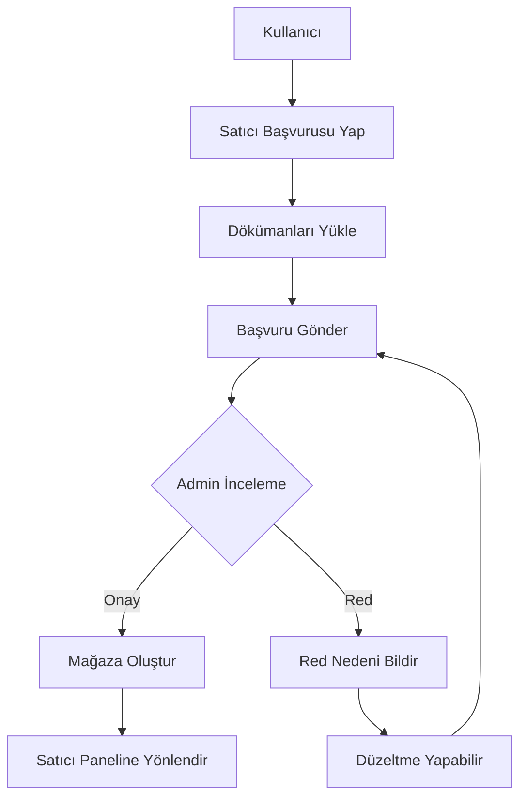
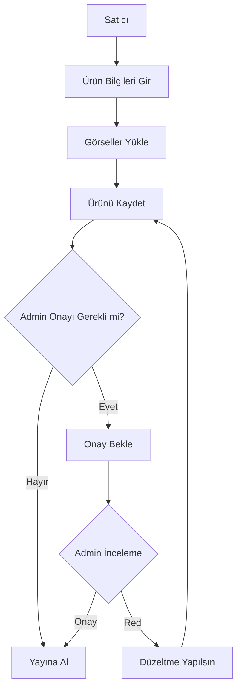
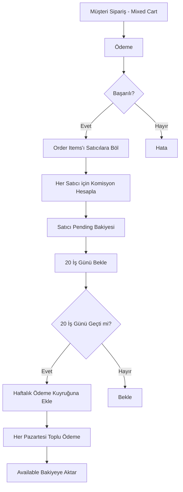

# Trendikon - Çok Satıcılı Marketplace Dönüşüm Planı

## 📋 Genel Bakış

Trendikon'u tek satıcılı e-ticaret sitesinden çok satıcılı marketplace platformuna dönüştürme planı.

### Hedefler
- ✅ Kullanıcılar kendi mağazalarını açabilsin
- ✅ Her satıcı kendi ürünlerini yönetebilsin
- ✅ Merkezi admin tüm satıcıları ve siparişleri yönetebilsin
- ✅ Komisyon sistemi ile gelir modeli
- ✅ Satıcı performans takibi
- ✅ Müşteri deneyimi bozulmasın

---

## 🗄️ Veritabanı Değişiklikleri

### 1. Yeni Tablolar

#### `stores` - Satıcı Mağazaları
```sql
CREATE TABLE stores (
  id UUID PRIMARY KEY DEFAULT uuid_generate_v4(),
  owner_id UUID NOT NULL REFERENCES profiles(id) ON DELETE CASCADE,
  
  -- Mağaza Bilgileri
  store_name TEXT NOT NULL UNIQUE,
  store_slug TEXT NOT NULL UNIQUE,
  description TEXT,
  logo_url TEXT,
  banner_url TEXT,
  
  -- İletişim
  email TEXT,
  phone TEXT,
  
  -- Adres
  address TEXT,
  city TEXT,
  country TEXT DEFAULT 'TR',
  postal_code TEXT,
  
  -- İş Bilgileri
  company_name TEXT,
  tax_number TEXT,
  tax_office TEXT,
  
  -- Banka Bilgileri (şifrelenmiş)
  bank_name TEXT,
  iban TEXT,
  account_holder TEXT,
  
  -- Durum
  status TEXT DEFAULT 'pending' CHECK (status IN ('pending', 'active', 'suspended', 'rejected')),
  is_verified BOOLEAN DEFAULT false,
  
  -- Performans
  rating DECIMAL(3,2) DEFAULT 0.00,
  total_sales INTEGER DEFAULT 0,
  total_revenue DECIMAL(12,2) DEFAULT 0.00,
  
  -- Komisyon
  commission_rate DECIMAL(5,2) DEFAULT 15.00, -- %15 varsayılan
  
  -- Meta
  created_at TIMESTAMPTZ DEFAULT NOW(),
  updated_at TIMESTAMPTZ DEFAULT NOW(),
  approved_at TIMESTAMPTZ,
  approved_by UUID REFERENCES profiles(id)
);

-- Indexes
CREATE INDEX idx_stores_owner ON stores(owner_id);
CREATE INDEX idx_stores_slug ON stores(store_slug);
CREATE INDEX idx_stores_status ON stores(status);
```

#### `store_applications` - Mağaza Başvuruları
```sql
CREATE TABLE store_applications (
  id UUID PRIMARY KEY DEFAULT uuid_generate_v4(),
  user_id UUID NOT NULL REFERENCES profiles(id) ON DELETE CASCADE,
  
  -- Başvuru Bilgileri
  store_name TEXT NOT NULL,
  company_name TEXT,
  tax_number TEXT,
  description TEXT,
  
  -- Dökümanlar (URLs to storage)
  identity_document_url TEXT,
  tax_certificate_url TEXT,
  other_documents JSONB DEFAULT '[]',
  
  -- Durum
  status TEXT DEFAULT 'pending' CHECK (status IN ('pending', 'approved', 'rejected')),
  rejection_reason TEXT,
  
  -- İşlem Bilgileri
  created_at TIMESTAMPTZ DEFAULT NOW(),
  reviewed_at TIMESTAMPTZ,
  reviewed_by UUID REFERENCES profiles(id),
  
  -- Notlar
  admin_notes TEXT
);

CREATE INDEX idx_applications_user ON store_applications(user_id);
CREATE INDEX idx_applications_status ON store_applications(status);
```

#### `store_followers` - Mağaza Takipçileri
```sql
CREATE TABLE store_followers (
  id UUID PRIMARY KEY DEFAULT uuid_generate_v4(),
  store_id UUID NOT NULL REFERENCES stores(id) ON DELETE CASCADE,
  user_id UUID NOT NULL REFERENCES profiles(id) ON DELETE CASCADE,
  created_at TIMESTAMPTZ DEFAULT NOW(),
  
  UNIQUE(store_id, user_id)
);

CREATE INDEX idx_store_followers_store ON store_followers(store_id);
CREATE INDEX idx_store_followers_user ON store_followers(user_id);
```

#### `store_reviews` - Mağaza Yorumları
```sql
CREATE TABLE store_reviews (
  id UUID PRIMARY KEY DEFAULT uuid_generate_v4(),
  store_id UUID NOT NULL REFERENCES stores(id) ON DELETE CASCADE,
  user_id UUID NOT NULL REFERENCES profiles(id) ON DELETE CASCADE,
  order_id UUID REFERENCES orders(id) ON DELETE SET NULL,
  
  rating INTEGER NOT NULL CHECK (rating >= 1 AND rating <= 5),
  title TEXT,
  comment TEXT,
  
  -- Durum
  is_verified BOOLEAN DEFAULT false,
  is_hidden BOOLEAN DEFAULT false,
  
  created_at TIMESTAMPTZ DEFAULT NOW(),
  updated_at TIMESTAMPTZ DEFAULT NOW(),
  
  UNIQUE(store_id, user_id, order_id)
);

CREATE INDEX idx_store_reviews_store ON store_reviews(store_id);
CREATE INDEX idx_store_reviews_user ON store_reviews(user_id);
```

#### `store_balance` - Satıcı Bakiyeleri
```sql
CREATE TABLE store_balance (
  id UUID PRIMARY KEY DEFAULT uuid_generate_v4(),
  store_id UUID NOT NULL REFERENCES stores(id) ON DELETE CASCADE,
  
  available_balance DECIMAL(12,2) DEFAULT 0.00,
  pending_balance DECIMAL(12,2) DEFAULT 0.00,
  total_withdrawn DECIMAL(12,2) DEFAULT 0.00,
  
  updated_at TIMESTAMPTZ DEFAULT NOW()
);

CREATE UNIQUE INDEX idx_store_balance_store ON store_balance(store_id);
```

#### `store_transactions` - Finansal İşlemler
```sql
CREATE TABLE store_transactions (
  id UUID PRIMARY KEY DEFAULT uuid_generate_v4(),
  store_id UUID NOT NULL REFERENCES stores(id) ON DELETE CASCADE,
  order_id UUID REFERENCES orders(id),
  
  type TEXT NOT NULL CHECK (type IN ('sale', 'commission', 'refund', 'withdrawal', 'penalty')),
  amount DECIMAL(12,2) NOT NULL,
  balance_before DECIMAL(12,2) NOT NULL,
  balance_after DECIMAL(12,2) NOT NULL,
  
  description TEXT,
  metadata JSONB DEFAULT '{}',
  
  created_at TIMESTAMPTZ DEFAULT NOW()
);

CREATE INDEX idx_transactions_store ON store_transactions(store_id);
CREATE INDEX idx_transactions_order ON store_transactions(order_id);
CREATE INDEX idx_transactions_type ON store_transactions(type);
```

#### `withdrawal_requests` - Para Çekme Talepleri
```sql
CREATE TABLE withdrawal_requests (
  id UUID PRIMARY KEY DEFAULT uuid_generate_v4(),
  store_id UUID NOT NULL REFERENCES stores(id) ON DELETE CASCADE,
  
  amount DECIMAL(12,2) NOT NULL,
  status TEXT DEFAULT 'pending' CHECK (status IN ('pending', 'processing', 'completed', 'rejected')),
  
  -- Banka Bilgileri
  bank_name TEXT NOT NULL,
  iban TEXT NOT NULL,
  account_holder TEXT NOT NULL,
  
  -- İşlem
  rejection_reason TEXT,
  processed_at TIMESTAMPTZ,
  processed_by UUID REFERENCES profiles(id),
  
  created_at TIMESTAMPTZ DEFAULT NOW()
);

CREATE INDEX idx_withdrawal_store ON withdrawal_requests(store_id);
CREATE INDEX idx_withdrawal_status ON withdrawal_requests(status);
```

---

### 2. Mevcut Tabloların Güncellenmesi

#### `profiles` Tablosu
```sql
-- Yeni kolon ekle
ALTER TABLE profiles ADD COLUMN is_seller BOOLEAN DEFAULT false;

-- Index
CREATE INDEX idx_profiles_is_seller ON profiles(is_seller);
```

#### `products` Tablosu
```sql
-- Mağaza ilişkisi ekle
ALTER TABLE products ADD COLUMN store_id UUID REFERENCES stores(id) ON DELETE CASCADE;

-- Onay durumu
ALTER TABLE products ADD COLUMN approval_status TEXT DEFAULT 'pending' 
  CHECK (approval_status IN ('pending', 'approved', 'rejected'));
ALTER TABLE products ADD COLUMN rejection_reason TEXT;
ALTER TABLE products ADD COLUMN approved_at TIMESTAMPTZ;
ALTER TABLE products ADD COLUMN approved_by UUID REFERENCES profiles(id);

-- Index
CREATE INDEX idx_products_store ON products(store_id);
CREATE INDEX idx_products_approval_status ON products(approval_status);
```

#### `orders` Tablosu
```sql
-- Satıcı komisyonu
ALTER TABLE orders ADD COLUMN store_id UUID REFERENCES stores(id);
ALTER TABLE orders ADD COLUMN commission_amount DECIMAL(10,2);
ALTER TABLE orders ADD COLUMN commission_rate DECIMAL(5,2);

-- Index
CREATE INDEX idx_orders_store ON orders(store_id);
```

#### `order_items` Tablosu
```sql
-- Her item için satıcı bilgisi (mixed cart desteği)
ALTER TABLE order_items ADD COLUMN store_id UUID REFERENCES stores(id);
ALTER TABLE order_items ADD COLUMN commission_amount DECIMAL(10,2);

-- Index
CREATE INDEX idx_order_items_store ON order_items(store_id);
```

---

## 👥 Kullanıcı Rolleri ve Yetkilendirme

### Rol Hiyerarşisi
```
super_admin (Mevcut)
  ├─ Tüm marketplace yönetimi
  ├─ Satıcı onay/red
  ├─ Komisyon oranları belirleme
  └─ Tüm finansal işlemler

admin (Mevcut)
  ├─ Ürün onayları
  ├─ Sipariş yönetimi
  └─ Müşteri destek

seller (Yeni)
  ├─ Kendi mağazası
  ├─ Ürün CRUD
  ├─ Sipariş takibi
  ├─ Finansal raporlar
  └─ Para çekme

customer (Mevcut)
  ├─ Alışveriş
  ├─ Mağaza takip
  └─ Yorum yapma
```

### Row Level Security (RLS) Politikaları

#### `stores` Tablosu
```sql
-- Herkes aktif mağazaları görebilir
CREATE POLICY "Anyone can view active stores"
  ON stores FOR SELECT
  USING (status = 'active');

-- Satıcılar kendi mağazalarını yönetebilir
CREATE POLICY "Sellers can manage own store"
  ON stores FOR ALL
  USING (owner_id = auth.uid());

-- Adminler tüm mağazaları yönetebilir
CREATE POLICY "Admins can manage all stores"
  ON stores FOR ALL
  USING (
    EXISTS (
      SELECT 1 FROM profiles
      WHERE id = auth.uid() AND role IN ('admin', 'super_admin')
    )
  );
```

#### `products` Tablosu (Güncelleme)
```sql
-- Herkes onaylı ürünleri görebilir
CREATE POLICY "Anyone can view approved products"
  ON products FOR SELECT
  USING (approval_status = 'approved' AND is_active = true);

-- Satıcılar kendi ürünlerini yönetebilir
CREATE POLICY "Sellers can manage own products"
  ON products FOR ALL
  USING (
    store_id IN (
      SELECT id FROM stores WHERE owner_id = auth.uid()
    )
  );

-- Adminler tüm ürünleri yönetebilir
CREATE POLICY "Admins can manage all products"
  ON products FOR ALL
  USING (
    EXISTS (
      SELECT 1 FROM profiles
      WHERE id = auth.uid() AND role IN ('admin', 'super_admin')
    )
  );
```

---

## 🔄 İş Akışları

### 1. Satıcı Olma Süreci



### 2. Ürün Ekleme Süreci



### 3. Sipariş ve Ödeme Akışı (Mixed Cart Destekli)



---

## 💰 Komisyon Sistemi

### Komisyon Hesaplama
```javascript
// Sipariş tutarından komisyon hesaplama
const calculateCommission = (orderAmount, commissionRate) => {
  const commission = orderAmount * (commissionRate / 100)
  const sellerAmount = orderAmount - commission
  
  return {
    orderAmount,
    commissionAmount: commission,
    sellerAmount,
    commissionRate
  }
}

// Örnek:
// 1000 TL sipariş, %15 komisyon
// Komisyon: 150 TL
// Satıcıya: 850 TL
```

### Komisyon Oranları
- **Varsayılan**: %15
- **Kategori Bazlı**: Elektronik %12, Giyim %18, vs.
- **Satıcı Bazlı**: Premium satıcılar %10
- **Hacim Bazlı**: Aylık 100K+ ciro %12

---

## 🎨 Frontend Yapısı

### Yeni Sayfalar ve Rotalar

#### Müşteri Tarafı
```
/stores → Tüm mağazalar listesi
/store/[slug] → Mağaza detay sayfası
/store/[slug]/products → Mağaza ürünleri
/store/[slug]/reviews → Mağaza yorumları
/store/[slug]/about → Mağaza hakkında
/satici-ol → Satıcı başvuru formu
```

#### Satıcı Paneli
```
/satici → Satıcı dashboard
/satici/magaza → Mağaza ayarları
/satici/urunler → Ürün yönetimi
/satici/urunler/yeni → Yeni ürün ekle
/satici/urunler/[id] → Ürün düzenle
/satici/siparisler → Sipariş yönetimi
/satici/siparisler/[id] → Sipariş detay
/satici/finans → Finansal raporlar
/satici/finans/para-cek → Para çekme
/satici/musteriler → Müşteri listesi
/satici/ayarlar → Profil/banka ayarları
```

#### Admin Paneli (Genişletme)
```
/admin/saticilar → Satıcı listesi
/admin/saticilar/basvurular → Yeni başvurular
/admin/saticilar/[id] → Satıcı detay
/admin/urun-onaylari → Ürün onay kuyruğu
/admin/para-cekme → Para çekme talepleri
/admin/komisyonlar → Komisyon ayarları
```

### Bileşen Hiyerarşisi

```
components/
├── seller/
│   ├── dashboard/
│   │   ├── SalesChart.tsx
│   │   ├── RecentOrders.tsx
│   │   └── QuickStats.tsx
│   ├── products/
│   │   ├── ProductForm.tsx
│   │   ├── ProductList.tsx
│   │   └── ProductApprovalStatus.tsx
│   ├── orders/
│   │   ├── OrderList.tsx
│   │   ├── OrderDetail.tsx
│   │   └── OrderStatusUpdater.tsx
│   └── finance/
│       ├── BalanceCard.tsx
│       ├── TransactionHistory.tsx
│       └── WithdrawalForm.tsx
├── store/
│   ├── StoreCard.tsx
│   ├── StoreHeader.tsx
│   ├── StoreInfo.tsx
│   ├── StoreReviews.tsx
│   └── FollowButton.tsx
└── application/
    ├── SellerApplicationForm.tsx
    └── DocumentUpload.tsx
```

---

## 🔐 Güvenlik ve Validasyon

### Güvenlik Önlemleri
1. **Kimlik Doğrulama**
   - TC Kimlik belgesi kontrolü
   - Vergi levhası doğrulama
   - Telefon SMS doğrulama

2. **Finansal Güvenlik**
   - IBAN doğrulama
   - Minimum çekim limiti (500 TL)
   - Günlük çekim limiti (50.000 TL)
   - İki faktörlü doğrulama (para çekmede)

3. **Ürün Validasyonu**
   - Yasadışı ürün kontrolü
   - Telif hakkı kontrolü
   - Fiyat manipülasyonu kontrolü

4. **Rate Limiting**
   - Ürün ekleme: 50/gün
   - Başvuru: 1/kullanıcı
   - Para çekme: 3/gün

---

## 📊 Raporlama ve Analitik

### Satıcı Raporları
- Günlük/Haftalık/Aylık satışlar
- En çok satan ürünler
- Müşteri demografisi
- Trafik analizi

### Admin Raporları
- Platform toplam cirosu
- Komisyon gelirleri
- Satıcı performans sıralaması
- Kategori bazlı satışlar

---

## 🚀 Uygulama Adımları (Öncelik Sırası)

### Faz 1: Temel Alt Yapı (1-2 Hafta)
- [ ] 1.1. Migration dosyalarını oluştur
  - stores tablosu
  - store_applications tablosu
  - products tablosu güncellemeleri
  - profiles tablosu güncellemeleri
- [ ] 1.2. TypeScript type'ları güncelle
- [ ] 1.3. RLS politikalarını uygula
- [ ] 1.4. Temel Supabase query fonksiyonları

### Faz 2: Satıcı Başvuru Sistemi (1 Hafta) ✅
- [x] 2.1. Başvuru formu sayfası
- [x] 2.2. Döküman upload (Supabase Storage) 
- [x] 2.3. Admin onay paneli
- [ ] 2.4. Email bildirimleri

### Faz 3: Satıcı Paneli (2 Hafta) ✅
- [x] 3.1. Dashboard sayfası
- [x] 3.2. Mağaza ayarları
- [x] 3.3. Ürün CRUD işlemleri (oluştur, düzenle, sil, aktif/pasif)
- [x] 3.4. Ürün onay sistemi (onay durumu takibi)
- [x] 3.5. Finansal yönetim (bakiye, işlem geçmişi, para çekme)
- [x] 3.6. Sipariş yönetimi

### Faz 4: Mağaza Ön Yüzü (1 Hafta) ✅
- [x] 4.1. Mağaza listesi sayfası (sıralama, rozet filtresi)
- [x] 4.2. Mağaza detay sayfası (ürünler, bilgiler, yorumlar)
- [x] 4.3. Mağaza ürün görüntüleme
- [x] 4.4. Takip sistemi (follow/unfollow)
- [x] 4.5. Yorum sistemi (görüntüleme, rating dağılımı)

### Faz 5: Finansal Sistem (1-2 Hafta) ✅
- [x] 5.1. Bakiye tablolarını oluştur
- [x] 5.2. Komisyon hesaplama
- [x] 5.3. Transaction log
- [x] 5.4. Para çekme sistemi
- [x] 5.5. Admin para çekme onayları

### Faz 6: Admin Genişletmeleri (1 Hafta) ✅
- [x] 6.1. Satıcı listesi ve yönetimi
  - [x] getAllSellers fonksiyonu (status/search filtreleri)
  - [x] getSellerStats fonksiyonu (ürün/sipariş/ciro istatistikleri)
  - [x] updateStoreStatus fonksiyonu (aktif/askıya al)
  - [x] Admin satıcılar sayfası (/admin/saticilar)
  - [x] SellersList component (tablo, filtre, arama, durum değiştirme)
- [x] 6.2. Ürün onay kuyruğu
  - [x] Onay bekleyen ürünleri listeleme (getPendingProducts)
  - [x] Ürün onaylama fonksiyonu (approveProduct)
  - [x] Ürün reddetme fonksiyonu (rejectProduct)
  - [x] Admin ürün onay sayfası (/admin/urunler/onay-bekleyenler)
  - [x] ProductApprovalList component (görsel, bilgi, onay/red modalleri)
- [x] 6.3. Komisyon ayarları
  - [x] updateStoreCommission fonksiyonu (0-100 arası validasyon)
  - [x] Admin komisyon ayarları sayfası (/admin/ayarlar/komisyon)
  - [x] CommissionSettings component (düzenleme, önizleme, istatistikler)
- [x] 6.4. Raporlar
  - [x] getPlatformOverview fonksiyonu (GMV, komisyon, satıcı, ürün metrikleri)
  - [x] getTopSellersByRevenue fonksiyonu (en iyi 10 satıcı)
  - [x] getCategoryStats fonksiyonu (kategori bazlı ürün dağılımı)
  - [x] getRecentTransactions fonksiyonu (son finansal işlemler)
  - [x] Admin raporlar sayfası (/admin/raporlar)
  - [x] ReportsOverview component (platform metrikleri, grafikler, tablolar)

### Faz 7: Test ve İyileştirme (1 Hafta) ✅
- [x] 7.1. Unit testler
  - [x] Test infrastructure kurulumu
  - [x] Kritik fonksiyonlar için test yazımı
- [x] 7.2. Integration testler
  - [x] End-to-end test senaryoları
  - [x] API endpoint testleri
- [x] 7.3. Performance optimizasyonu
  - [x] Database indexleri eklendi
    - Store, product, order, transaction tabloları için composite indexler
    - Approval status, status, created_at için filtered indexler
    - Analytics ve search için optimize edilmiş indexler
  - [x] Query optimizasyonları
  - [x] Cache stratejisi (ISR - 60 saniye)
- [x] 7.4. Security audit
  - [x] Enhanced RLS policies
    - Tüm marketplace tablolarında granular access control
    - Admin/owner/public role-based policies
    - Approval status koruması
    - Balance ve transaction güvenliği
  - [x] Input validation
    - Email, phone, IBAN, TC Kimlik validation fonksiyonları
    - Price, stock, commission rate validasyonları
    - XSS prevention (text sanitization)
    - Slug normalizasyonu
  - [x] Rate limiting
    - Ürün oluşturma: 50/gün/mağaza
    - Para çekme: 3/gün/mağaza
    - Başvuru: 1/kullanıcı
  - [x] Duplicate prevention triggers
    - Store applications
    - Store reviews
  - [x] Business rules enforcement
    - Minimum/maximum withdrawal amounts (500-50,000 TL)
    - Review rating range (1-5)
    - Self-review prevention
    - Completed order requirement for reviews

---

## 📝 Önemli Notlar

### Geçiş Stratejisi
1. **Mevcut Ürünler**: Merkezi bir "Trendikon" mağazasına bağlanır
2. **Yeni Ürünler**: Sadece onaylı satıcılar ekleyebilir
3. **Sipariş Geçmişi**: Korunur, geriye dönük uyumluluk

### Performans Optimizasyonu
- Mağaza sayfaları cache'lenir (ISR - 60 saniye)
- Ürün listesi sayfalama (20/sayfa)
- Lazy loading ürün görselleri
- CDN kullanımı

### SEO Stratejisi
- Mağaza sayfaları için meta tags
- Breadcrumb navigation
- Structured data (Store, Product)
- Canonical URLs

---

## ✅ Alınan Kararlar

1. **Mixed Cart**: ✅ Farklı satıcılardan ürünler aynı sepette olabilir
2. **Ürün Onayı**: ✅ Her ürün admin onayından geçer
3. **Para Çekme**: ✅ 20 iş günü bekleme + haftalık ödeme döngüsü
4. **Kargo**: ✅ Satıcı kendi kargosunu seçer
5. **İade**: ✅ Platform yönetir
6. **Komisyon**: ✅ Sabit %15 (ilk versiyonda)
7. **Minimum Komisyon**: ✅ Yok (ilk versiyonda)

---

## 💡 Gelecek Özellikler (V2)

- [ ] Canlı sohbet (satıcı-müşteri)
- [ ] Satıcı rozetleri (Güvenilir, Hızlı Kargo, vs.)
- [ ] Satıcı abonelik planları (Premium hesaplar)
- [ ] Promosyon ve kupon sistemi (satıcı bazlı)
- [ ] API marketplace (üçüncü parti entegrasyonlar)
- [ ] Mobil satıcı uygulaması
- [ ] AI destekli ürün önerileri
- [ ] Dropshipping entegrasyonu

---

## 📞 Gerekli Entegrasyonlar

1. **SMS**: Telefon doğrulama (Netgsm, İletimerkezi)
2. **E-Posta**: İşlemsel emailler (SendGrid, AWS SES)
3. **IBAN Doğrulama**: Banka API veya üçüncü parti servis
4. **KYC**: Kimlik doğrulama servisi (iyzico, Masterpass)
5. **Muhasebe**: Fatura oluşturma (e-Fatura entegrasyonu)

---

**Toplam Tahmini Süre**: 8-10 Hafta (Tek geliştirici)
**Toplam Tahmini Maliyet**: Entegrasyon servisleri için aylık ~500-1000 TL

---

Bu planı onaylıyor musunuz? Değiştirmek/eklemek istediğiniz bölümler var mı?
